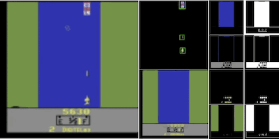

# SPACE

This is an official PyTorch implementation of the SPACE model presented in the following paper:

> [SPACE: Unsupervised Object-Oriented Scene Representation via Spatial Attention and Decomposition](https://arxiv.org/abs/2001.02407)  
> *{[Zhixuan Lin](https://www.google.com/url?q=https%3A%2F%2Fwww.zhixuanlin.com%2F&sa=D&sntz=1&usg=AFQjCNEh-Y3e9ey472MfGdTmhEUQcLoRug), [Yi-Fu Wu](http://www.google.com/url?q=http%3A%2F%2Fwww.yifuwu.com%2F&sa=D&sntz=1&usg=AFQjCNGq_BQG2SnAYFsvwGuDFkNLUdFU_A), [Skand Vishwanath Peri](http://www.google.com/url?q=http%3A%2F%2Fpvskand.github.io&sa=D&sntz=1&usg=AFQjCNGmDcD9SZNhmXeJIbxwLG4zlqB9tg)}, Weihao Sun, [Gautam Singh](http://www.google.com/url?q=http%3A%2F%2Fsinghgautam.github.io%2F&sa=D&sntz=1&usg=AFQjCNF7UbTUKtzr0VwwYZ7Z2oVdgir0fw), Fei Deng, [Jindong Jiang](https://www.google.com/url?q=https%3A%2F%2Fwww.jindongjiang.me&sa=D&sntz=1&usg=AFQjCNGMRnKNbnqFNIDCDGkb3lziYgUpJQ), [Sungjin Ahn](http://www.google.com/url?q=http%3A%2F%2Fwww.sungjinahn.com%2Fhome&sa=D&sntz=1&usg=AFQjCNFM7arcABqEtSI15Bl6EsrH4Ajm2g)*  
> *ICLR 2020*  
> [Project page](https://sites.google.com/view/space-project-page)   

 </img>

## General

Project directories:

* `src`: source code
* `data`: where you should put the datasets
* `output`: anything the program outputs will be saved here. These include
  * `output/checkpoints`: training checkpoints. Also, model weights with the best performance will be saved here
  * `output/logs`: tensorboard event files
  * `output/eval`: quantitative evaluation results
  * `output/demo`: demo images
* `scripts`: some useful scripts for downloading things and showing demos
* `pretrained`: where to put downloaded pretrained models

This project uses [YACS](https://github.com/rbgirshick/yacs) for managing experiment configurations. Configurations are specified with YAML files. These files are in `src/configs`. We provide five YAML files that correspond to the figures in the paper:

* `3d_room_large.yaml`: for the 3D Room Large dataset
* `3d_room_small.yaml`: for 3D Room Small dataset
* `atari_spaceinvaders.yaml`: for the Space Invaders game
* `atari_riverraid.yaml`: for the River Raid game
* `atari_joint.yaml`: for joint training on 10 Atari games

## Dependencies

This project uses Python 3.7 and PyTorch 1.3.0. 

Create a conda environment with Python 3.7 and activate it. Other versions of Python should also be fine:

```
conda create -n space python=3.7
conda activate space
```

Install PyTorch 1.3.0:

```
pip install torch==1.3.0+cu100 torchvision==0.4.1+cu100 -f https://download.pytorch.org/whl/torch_stable.html
```

Note that this requires CUDA 10.0. If you need CUDA 9.2 then change `cu100` to `cu92`. Depending on your cuda version, you may want to install previous versions of PyTorch.  See [here](https://pytorch.org/get-started/previous-versions/).

Other requirements are in `requirements.txt` and can be installed with

```
pip install -r requirements.txt
```

[TensorBoard](https://www.tensorflow.org/tensorboard) is used for training visualization and included in `requirements.txt`. In some cases, TensorBoard without a full TensorFlow installation can show some weird behaviors (not loading logs, etc.). If that happens, consider installing full TensorFlow.

## Datasets

The following datasets with Google Drive download links are provided:  

* 3D Room Large : [`OBJ3D_LARGE.tar.gz`](https://drive.google.com/open?id=1gE3kr_ZLdsMRr263K2v1HhyfJehhW7Pi) (1.4G)
* 3D Room Small: [`OBJ3D_SMALL.tar.gz`](https://drive.google.com/open?id=18Ta1sWCyprv0QPGMUOMMPFWac8KFICMN) (156M)
* Atari (with 11 games): [`ATARI.tar.gz`](https://drive.google.com/open?id=1vzFVFhJZDZMkJ8liROtIyzOiUY42r4TZ) (2.2G)

Depending on your need, you can download one or more of these datasets. Two download options are available:

* **Download with scripts**. Run one or more of the following scripts:

  ```sh
  # Run one or more of these
  sh scripts/download_data_3dlarge.sh
  sh scripts/download_data_3dsmall.sh
  sh scripts/download_data_atari.sh
  ```

  Datasets will be downloaded to `data` and decompressed.

* **Manual download**. Alternatively, you can manually download them with the provided Google Drive links, put them under the `data` directory, and decompress them with `tar -xzf [FILE].tar.gz`. 

The `data` directory should look like this (if you have downloaded all three datasets):

```
data
├── OBJ3D_LARGE
│   ├── test
│   ├── train
│   └── val
├── OBJ3D_SMALL
│   ├── test
│   ├── train
│   └── val
└── ATARI
    ├── Asterix-v0
    ├── Atlantis-v0
    ├── Carnival-v0
    ├── DoubleDunk-v0
    ├── Kangaroo-v0
    ├── MontezumaRevenge-v0
    ├── MsPacman-v0
    ├── Pooyan-v0
    ├── Qbert-v0
    ├── Riverraid-v0
    └── SpaceInvaders-v0

```


## Quick demo with pretrained models

To download pretrained models, two options are available:

* **Download with scripts**. Run the following script to download pretrained models:

  ```
  sh scripts/download_pretrained.sh
  ```

  Pretrained models will be downloaded to the `pretrained` directory and decompressed. 

* **Manual download**. Alternatively, you can manually download the files (in one compressed file `pretrained.tar.gz`) with [this Google Drive link](https://drive.google.com/open?id=1gUvLTfy5pKeLa6k3RT8GiEXWiGG8XzzD) (239M), put it under the `pretrained` directory and decompress it with `tar -xzf pretrained.tar.gz`. 

The `pretrained` directory should look like this:

```
pretrained
├── 3d_room_large.pth
├── 3d_room_small.pth
├── atari_spaceinvaders.pth
├── atari_riverraid.pth
└── atari_joint.pth
```

Then run one of the following to create some visualizations, with either CPU or GPU:

```
# Use CPU
sh scripts/demo_cpu.sh
# Use GPU
sh scripts/demo_gpu.sh
```

Images showing foreground objects and background segmentation will be dumped to `output/demo`. If you have downloaded all three datasets, then five images `3d_room_large.png`, `3d_room_small.png`, `atari_spaceinvaders.png`, `atari_riverraid.png` and `atari_joint.png` will be generated in `output/demo`. Otherwise only some of them will be generated.

If you are using a remote server, you can then run 

```
python -m http.server -d output/demo 8080
```

and then visit `http://[your server's address]:8080` in your local browser to view these images. 

## Training and Evaluation

**First, `cd src`.  Make sure you are in the `src` directory for all commands in this section. All paths referred to are also relative to `src`**.

The general command to run the program is (assuming you are in the `src` directory)

```
python main.py --task [TASK] --config [PATH TO CONFIG FILE] [OTHER OPTIONS TO OVERWRITE DEFAULT YACS CONFIG...]
```

Detailed instructions will be given below.

**Training**. Run one or more of the following to train the model on the datasets you want:

* 3D Room Large:

  ```
  python main.py --task train --config configs/3d_room_large.yaml resume True device 'cuda:0'
  ```

* 3D Room Small:

  ```
  python main.py --task train --config configs/3d_room_small.yaml resume True device 'cuda:0'
  ```

* River Raid:

  ```
  python main.py --task train --config configs/atari_riverraid.yaml resume True device 'cuda:0'
  ```

* Space Invaders:

  ```
  python main.py --task train --config configs/atari_spaceinvaders.yaml resume True device 'cuda:0'
  ```

* Joint training on 10 Atari games:

  ```
  python main.py --task train --config configs/atari_joint.yaml resume True device 'cuda:0'
  ```

These start training with GPU 0 (`cuda:0`). There some useful options that you can specify. For example, if you want to use GPU 5, 6, 7, and 8 and resume from checkpoint `../output/checkpoints/3d_room_large/model_000008001.pth`, you can run the following:

```
python main.py --task train --config configs/3d_room_large.yaml \
	resume True resume_ckpt '../output/checkpoints/3d_room_large/model_000008001.pth' \
	parallel True device 'cuda:5' device_ids '[5, 6, 7, 8]'
```

Other available options are specified in `config.py`.

**Training visualization**. Run the following

```
# Run this from the 'src' directory
tensorboard --bind_all --logdir '../output/logs' --port 8848
```

And visit `http://[your server's address]:8848` in your local browser.

**Evaluation**. We only have ground truth for the two 3D Room datasets. After training is finished with the specified maximum steps (or you can stop them manually), run the following to evaluate APs and counting accuracy:

```
# Run one or more of these
python main.py --task eval --config configs/3d_room_large.yaml resume True device 'cuda:0'
python main.py --task eval --config configs/3d_room_small.yaml resume True device 'cuda:0'
```

The model with the best performance (average AP) will be loaded and evaluated. The results will be printed to stdout. They will also be saved to `../output/eval` as JSON files.

Alternatively, you can directly run evaluation using the pretrained models that we provided:

```
# Run one or more of these
python main.py --task eval --config configs/3d_room_large.yaml resume True device 'cuda:0' resume_ckpt '../pretrained/3d_room_large.pth'
python main.py --task eval --config configs/3d_room_small.yaml resume True device 'cuda:0' resume_ckpt '../pretrained/3d_room_small.pth'
```

## Issues

* For some reason we were using BGR images for our Atari dataset and our pretrained models can only handle that. Please convert the images to BGR if you are to test your own Atari images with the provided pretrained models.
* There is a chance that SPACE doesn't learn proper background segmentation for the 3D Room Large datasets. Due to the known [PyTorch reproducibity issue](https://pytorch.org/docs/stable/notes/randomness.html), we cannot guarantee each training run will produce exactly the same result even with the same seed. For the 3D Room Large datasets, if the model doesn't seem to be segmenting the background in 10k-15k steps, you may considering changing the seed and rerun (or not even changing the seed, it will be different anyway). Typically after trying 1 or 2 runs you will get a working version.

## Use SPACE for other tasks

If you want to apply SPACE to your own task (e.g., for RL), please be careful. Applying SPACE to RL is also our original intent, but we found that the model can sometimes be unstable and sensitive to hyperparameters and training tricks. There are several reasons:

1. **The definition of objects and background is ambiguous in many cases**. Atari is one case where objects are often well-defined. But in many other cases, it is not. For more complicated datasets, making SPACE separate foreground and background properly can be something non-trivial. 
2. **Learning is difficult when object sizes vary a lot**. In SPACE, we need to set a proper prior for object sizes manually and that turn out to be crucial hyperparameter. For example, for the 10 Atari games we tested, objects are small and roughly of the same size. When object sizes vary a lot SPACE may fail.

That said, we are pleased to offer discussions and pointers if you need help (especially when fine-tuning it on your own dataset). We also hope this will facilitate future works that overcome these limitations.

## Citation

If you find this code useful for your research, please cite our paper with the following BibTeX entry

```
@inproceedings{
	Lin2020SPACE,
	title={SPACE: Unsupervised Object-Oriented Scene Representation via Spatial Attention and Decomposition},
	author={Zhixuan Lin and Yi-Fu Wu and Skand Vishwanath Peri and Weihao Sun and Gautam Singh and Fei Deng and Jindong Jiang and Sungjin Ahn},
	booktitle={International Conference on Learning Representations},
	year={2020},
	url={https://openreview.net/forum?id=rkl03ySYDH}
}
```

## Acknowledgements

The evaluation code is adapted from the one used in [SPAIR](https://github.com/e2crawfo/auto_yolo). The code structure is inspired (and significantly simplified) by [Mask-RCNN](https://github.com/facebookresearch/maskrcnn-benchmark) (deprecated, with the latest being [Detectron2](https://github.com/facebookresearch/maskrcnn-benchmark)) from Facebook. Google Drive download commands are created with https://gdrive-wget.glitch.me/


